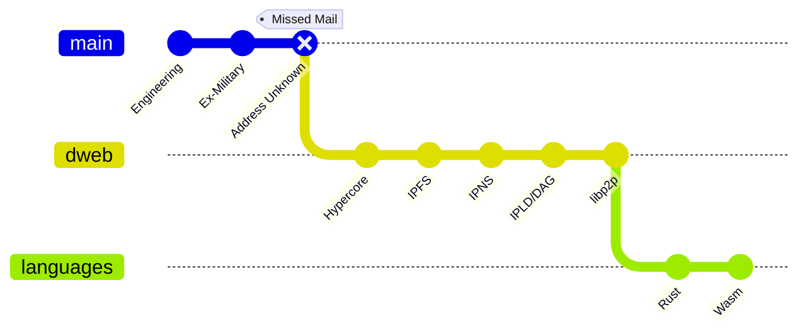
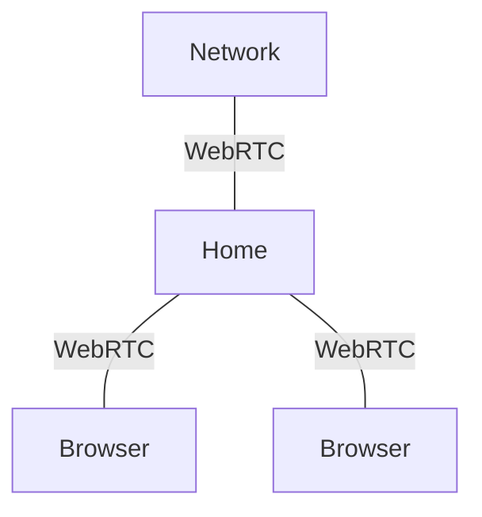
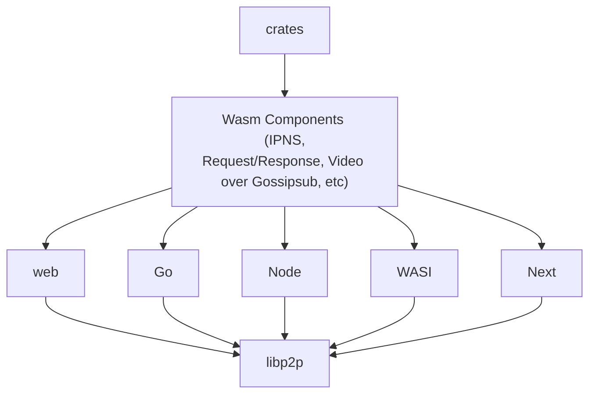

 
 
 

Libp2p ❤️ wasm

### @DougAnderson444

    Libp2p Day 

    Lab Week 2023

    <!-- Open link to https://github.com/DougAnderson444/libp2pday2023/edit/master/slides.md -->
  <button  title="Open in Editor" class="text-xl slidev-icon-btn opacity-50 !border-none !hover:text-white">

  <a href="https://github.com/DougAnderson444/libp2pday2023/edit/master/slides.md" target="_blank">
    <carbon:edit />
            </a>
  </button>
  <a href="https://github.com/DougAnderson444/libp2pday2023" target="_blank" alt="GitHub" title="Open in GitHub"
    class="text-xl slidev-icon-btn opacity-50 !border-none !hover:text-white">
    <carbon-logo-github />
  </a>

<!--
- Welcome to Istanbul! 
- Thanks to Protocol Labs for having me here
- I'm going to talk about the work we did bringing wasm WebRTC to rust-libp2p in the browser, and a bit about more possibilites for Wasm adjacent to libp2p. 
-->

---
layout: default
hideInToc: true
---

# Table of contents

<Toc minDepth="1" maxDepth="1"></Toc>

<!-- 
All these slides are available on Github in my repo, which we will link on the Libp2p day page. I've done my best to hyperlink the references so you can learn more about each topic.

I'm not sure what everyone's level of knowledge is with rust or webrtc or even libp2p, so I'll try my best not to insult anyone while at the same time not go over anyone's head.
-->

---
---

# Background

### In search of decentralized data pointers

* We need to be able to onboard people in the browser!

<!-- A bit of my background for context so you know where I'm coming from. I'm a community member, I don't work for, well any Web3 company because I wanted my R&D to be unbiased by hype until I found a technology that works. I did a full career as a Navy Engineering Officer which actually led me to the Web3 -- I moved a lot, had trouble keeping up with account changes, which led me to researching a raft of web3 tech. In the end, all roads led back to IPFS style technology which leads us here. -->

---
layout: image-right
image: ./webrtc.jpeg
---

# Why WebRTC?

### Goals

| **Outcome** | **Criteria** |
| --- | --- |
| Independence | Run own node, even at home |
| Adoption | Works in the browser |

---
layout: image-right
image: ./webrtc.jpeg
---

# Why WebRTC?

- 📜 **No TLS Certificate** - no need to have a domain name
- 💻 **Browser** - browser-to-browser compatible
- 🔟 **Data Channel** - Send bytes instead of audio/video

<!-- So why WebRTC? There are many transport options put there, many more robust. But one of my founding principles is that users should be able to run their own node, even at home without TLS from domain name. The other is we must be able to initially launch most of the stack in the browser for easy onboarding. The only transport that allows bo -->

<Arrow x1="220" y1="520" x2="270" y2="520" />
<Arrow x1="270" y1="520" x2="220" y2="520" />

More about [WebRTC](https://webrtc.org/)

<!--
When I first experimented with libp2p I discovered that not all Transports are created equal, and if you wanted to deploy outside of localhost, a TLS certificate from a domain was needed. Kind of puts damper on anything run by users at home. However, this was not the case with WebRTC.
-->

---
transition: slide-up
---

# Why _Browser_ Rust?

- 1️⃣ **Single Language Stack** - code reuse, less context switching
- ⚒️ **Strongly typed** - easier to manage expanding code base
- ⚙️  **Wasm native** - Rust is the most capable language for Wasm
- 📈 **Growing front-end list** - [Leptos](https://www.leptos.dev/), [Yew](https://yew.rs/), [Dioxus](https://dioxuslabs.com/), [Sycamore](https://sycamore-rs.netlify.app/), [Egui](https://github.com/emilk/egui)
- 📚 **Crates** - Many cryto libraries available in Rust

|  | ☕  | ❤️ | 
| - | --- | --- |
| Browser Crates Use | JS bindgen | Rust |
| Networking | JS | Rust* |
| Front-end | JS | Rust  |
| Back-end | Rust/Go/JS   | Rust   |

 

<!--
Isn't Rust a systems level language? That's like saying JavaScript is just for making a confetti and mouse sparkle trail.
-->

---
level: 1
---

# Varieties of WebAssembly

|     | Name| IO Bindings    | Usage |
| --- | --- | --- | --- |
| 1. | [`wasm-bindgen`](https://rustwasm.github.io/docs/wasm-bindgen/introduction.html) | builtin: [`web-sys`](https://rustwasm.github.io/wasm-bindgen/examples/dom.html) & [`js-sys`](https://docs.rs/js-sys/latest/js_sys/) | rust-libp2p webrtc, webtransport |
| 2. | [`wasm interface types`](https://github.com/bytecodealliance/wit-bindgen) | WASI & user defined | runs sandboxed sync code "anywhere" |
| 3. | [`wasm-rs`](https://github.com/WasmRS/wasmrs-rust) / [`wick`](https://candle.dev/docs/wick/) | async reactive streams | Streaming (Video over Gossipsub?) |
| 4. | [`ipvm`]() | TBD | TBD |

  

Since not all `libp2p` is I/O, we can ALSO use #2, #3!

---
level: 1
---

# Why Wasm Components? Code reuse.

    <Tweet id="1721877770681057737" scale="0.8" />

---

# Build once, run in any libp2p examples:

Some \[unimplemented\] ideas:

- 🎥 **Video over Gossipsub** - ffmpeg encoding/decoding
- 🔏 **Proof Systems** - build once, prove from any libp2p node
- 👜 **Wallets** - libp2p connected/backed up wallets

## Imagine being able to pull functionality off the shelf and plug it into your lib2p app!

---
layout: center
class: text-center
---

# Let's Build Networked Composable Web 

[https://github.com/DougAnderson444](https://github.com/DougAnderson444) 

[doug@peerpiper.io](mailto:doug@peerpiper.io) 

𝕏 [@DougAnderson444](https://twitter.com/DougAnderson444/) 

